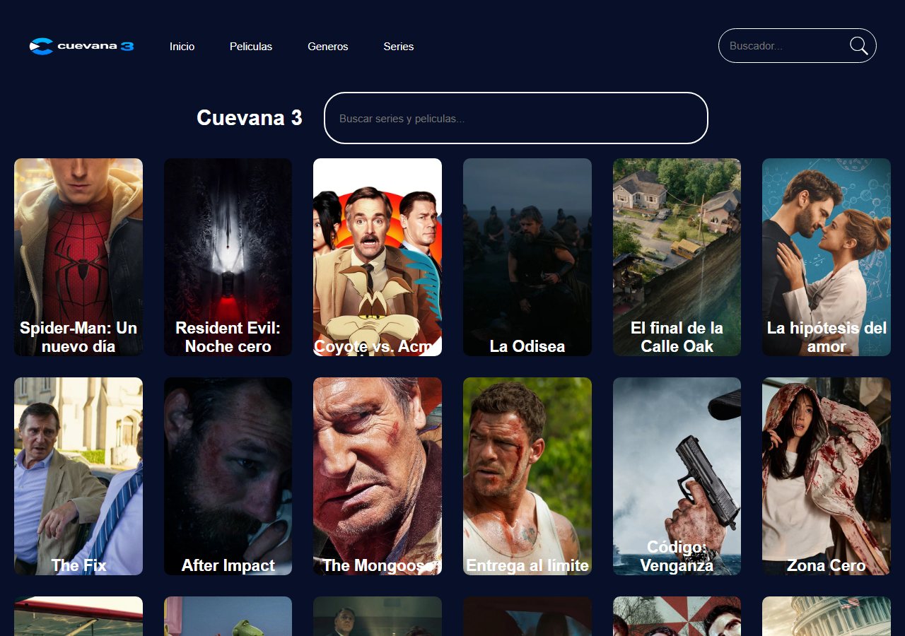

# Cuevana 3


Réplica de la interfaz de un catálogo de películas inspirado en *Cuevana 3*. Obtiene en tiempo real las películas más populares desde la API de **The Movie Database (TMDB)** y las muestra en una cuadrícula responsiva.

## Captura de pantalla



## Funcionalidades

- Consulta a `https://api.themoviedb.org/3/discover/movie` con **Axios**, ordenada por popularidad y en idioma **es-MX**.
- Generación dinámica de tarjetas con JavaScript: título, sinopsis e imagen de fondo (`backdrop_path`) de cada película.
- Cuadrícula responsiva con **CSS Grid** que se adapta a escritorio, tablet y móvil.
- Encabezado con navegación (Inicio, Películas, Géneros, Series) y buscador.
- Sección principal de búsqueda y pie de página con enlaces a redes sociales.
- Efecto *hover* sobre las tarjetas.

## Tecnologías utilizadas

| Tecnología | Uso |
| --- | --- |
| HTML5 | Estructura semántica (`header`, `main`, `section`, `footer`) |
| SCSS | Estilos organizados en parciales y mixins de breakpoints |
| JavaScript (ES6+) | Manipulación del DOM y `async/await` |
| Axios (CDN) | Peticiones HTTP |
| TMDB API | Fuente de datos de películas |
| Google Fonts | Tipografía *Open Sans* |

## Estructura del proyecto

```text
Cuevana-3/
├── index.html
├── js/functions.js        # Petición a TMDB y creación de tarjetas
├── CSS/
│   ├── main.scss          # Importa todos los parciales
│   ├── _base.scss         # Reset y mixins de breakpoints (70rem y 48rem)
│   ├── _header.scss
│   ├── _search.scss
│   ├── _movies-grid.scss
│   ├── _footer.scss
│   └── main.css           # CSS compilado
└── img/
```

## Instalación y uso

No requiere dependencias ni proceso de build.

```bash
git clone https://github.com/Donaldo500/Cuevana-3.git
cd Cuevana-3
```

Abre `index.html` en el navegador o, preferentemente, sírvelo con un servidor local, por ejemplo la extensión *Live Server* de VS Code o:

```bash
npx serve .
```

Para modificar los estilos, edita los archivos `.scss` y compílalos:

```bash
npx sass CSS/main.scss CSS/main.css --watch
```

### Clave de la API

La petición usa una clave de TMDB definida en `js/functions.js`. Si quieres usar la tuya, crea una cuenta gratuita en [themoviedb.org](https://www.themoviedb.org/settings/api) y reemplaza el valor de `api_key`.

## Ejemplos de uso

Así se obtiene y pinta cada película:

```js
const response = await axios.get("https://api.themoviedb.org/3/discover/movie", {
  params: { api_key: "TU_API_KEY", language: "es-MX", sort_by: "popularity.desc", page: 1 }
});

for (const movie of response.data.results) {
  moviesGrid.appendChild(createMovieCard(movie));
}
```

Para mostrar otra página del catálogo o cambiar el criterio de orden, modifica `page` o `sort_by` (por ejemplo `vote_average.desc`).

## Contribuciones

Proyecto individual con fines de aprendizaje. Las sugerencias son bienvenidas mediante issues o pull requests.

## Aviso

Proyecto educativo sin fines comerciales. Los datos e imágenes de películas provienen de TMDB. Este producto usa la API de TMDB pero no está avalado ni certificado por TMDB.

## Autor

**Donaldo Ibarra** - [@Donaldo500](https://github.com/Donaldo500)
